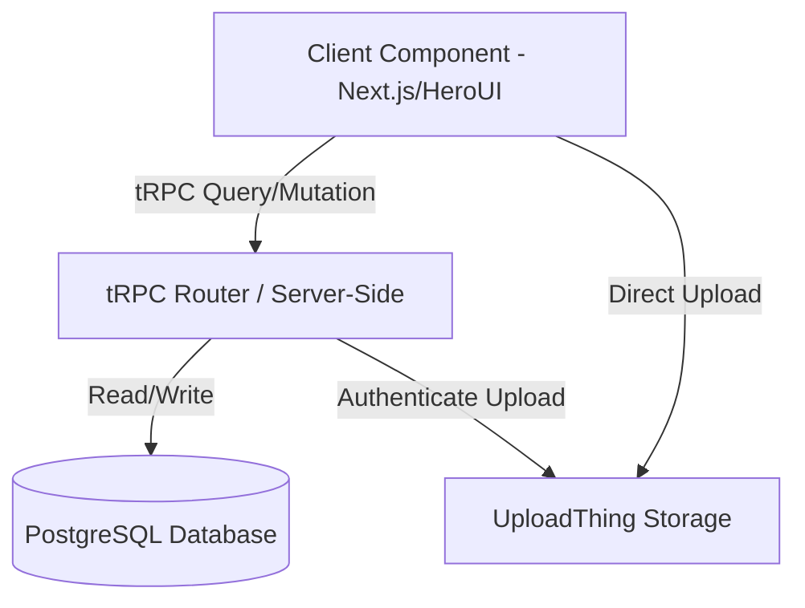
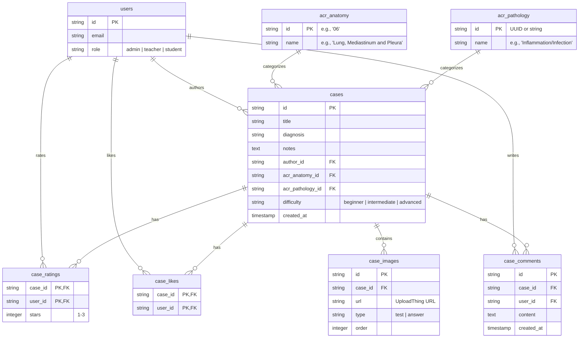
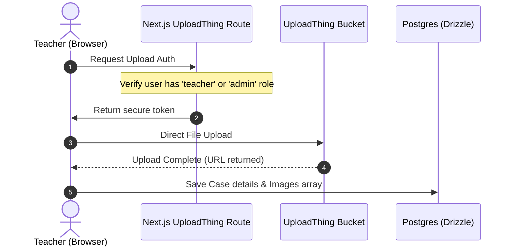

# Architecture Documentation 🩻

This document outlines the software architecture, database relations, role-based access control, and image upload workflow for the **RadCases** application.

---

## 1. Architectural Overview

RadCases follows a monorepo-style Next.js App Router architecture integrated with tRPC for end-to-end type-safe queries and mutations.

---

## 2. Role-Based Access Control (RBAC)

Authentication is powered by **Better Auth**, which manages session tokens and maps them to a `users` table. 

### Roles & Permissions Matrix
| Action | Student | Teacher | Admin |
| :--- | :---: | :---: | :---: |
| Browse / Search Cases | ✅ | ✅ | ✅ |
| Rate Cases (1-3 stars) | ✅ | ✅ | ✅ |
| Comment & Like | ✅ | ✅ | ✅ |
| Upload Radiologic Case | ❌ | ✅ | ✅ |
| Manage User Roles | ❌ | ❌ | ✅ |

### Middleware & tRPC Integration
*   **`protectedProcedure`**: Extends standard procedures to ensure the user is logged in.
*   **`teacherProcedure`**: Enforces that `ctx.session.user.role` is either `'teacher'` or `'admin'`.
*   **`adminProcedure`**: Enforces that `ctx.session.user.role` is `'admin'`.

Users register as `'student'` by default. The Admin elevates user roles via the Admin Dashboard.

---

## 3. Database Schema Design (Drizzle ORM)

The relational schema is configured in `src/server/db/schema.ts` as follows:

---

## 4. UploadThing Image Flow

To support large radiologic files efficiently, files are uploaded directly from the browser to UploadThing.

---

## 5. Querying & Performance Strategy

### Case Filtering & Search
*   **Partial Text Search:** Cases are searched using case-insensitive SQL `ilike` operations against the `title` and `notes` columns.
*   **Structured Filtering:** Filters filter records exactly matching `acr_anatomy_id`, `acr_pathology_id`, and `difficulty`.

### Aggregate Analytics
Drizzle Relational Queries (or SQL joins) aggregate:
1.  **Average Star Rating:** Calculated dynamically using `avg(case_ratings.stars)` and rounded to 1 decimal place.
2.  **Likes Count:** Count of entries in `case_likes` matching the `case_id`.
3.  **User State:** Checks whether the current requester has already liked/rated the case, indicating the state of the UI like button.
